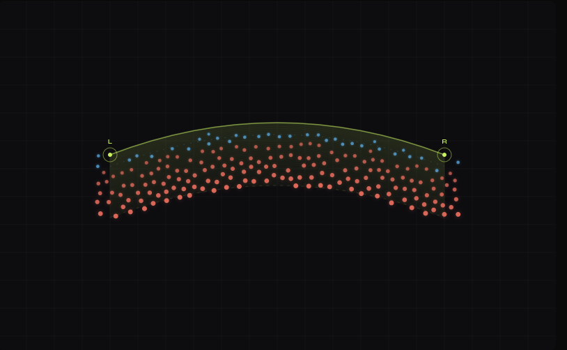

# Algorithmic-Hairline-Reconstruction

A procedural generation tool for hair transplant planning and hairline design. This project leverages advanced algorithms like Poisson Disk Sampling and Bezier curves to simulate natural hair follicle distributions and create aesthetically pleasing hairlines.

## Project Screenshots

Here are a couple of screenshots showcasing the interactive UI and the results of the algorithmic hairline generation:


*Example of procedural hairline generation with density variation.*


*Interactive Bezier curve controls for shaping the hairline.*


## Project Goal
To provide a flexible and intuitive tool for designing natural-looking hairlines, assisting in the planning phase of hair transplant procedures.

## Core Algorithms
*   **Poisson Disk Sampling:** Ensures organic, evenly distributed graft placement without clumping, mimicking natural follicle patterns.
*   **Bezier Curves:** Allow for smooth, dynamic definition of hairline arcs and curves using interactive anchor points.
*   **Stochastic Feathering:** Simulates natural density transitions, particularly at the leading edge of the hairline, for a softer, more realistic appearance.

## Features
*   **Procedural Distribution:** Utilizes Poisson Disk Sampling for organic, non-overlapping graft placement.
*   **Dynamic Arc Modeling:** Define hairlines using interactive anchor points and Bezier curvature for flexible shape control.
*   **Natural Transitioning:** Implements stochastic feathering logic to simulate low-density leading edges.
*   **Interactive Controls:** Real-time adjustment of spacing, depth, and density parameters for immediate visual feedback.

## Technical Stack
*   **Language:** JavaScript
*   **Core Logic:** Custom implementation of Poisson Disk Sampling and Bezier curve algorithms.
*   **Rendering:** HTML5 Canvas API for visualization.
*   **Dependencies:** Potentially a math library if complex calculations are offloaded.

## Getting Started
This is a client-side web application.
1.  Clone the repository:
    ```bash
    git clone https://github.com/arkalibaig/Algorithmic-Hairline-Reconstruction.git
    cd alhr
    ```
2.  Open the main HTML file (`alhr.html`) in your web browser. No server-side setup is required.

## Usage
Use the interactive controls to:
*   **Adjust Spacing:** Control the minimum and maximum distance between simulated follicles.
*   **Define Curvature:** Modify Bezier curve anchor points to shape the hairline.
*   **Set Density:** Control the density falloff towards the edges for a natural look.

*(Consider adding a placeholder for screenshots or a link to a live demo here)*

## Development Roadmap & Planned Improvements
This project is under active development. Current version is v0.1 (functional prototype).
*   Asymmetrical hairline controls for more organic designs.
*   Density heatmap visualization to better understand distribution.
*   Simulation of multi-layer graft depth for added realism.
*   Support for advanced export formats (e.g., SVG, JSON).

## Contribution Guidelines
Contributions are welcome! Please follow these steps:
1.  Fork the repository.
2.  Create a new branch for your feature or fix.
3.  Make your changes and ensure the application functions correctly.
4.  Submit a pull request with a clear description of your changes.

## License
This project is licensed under the MIT License.
