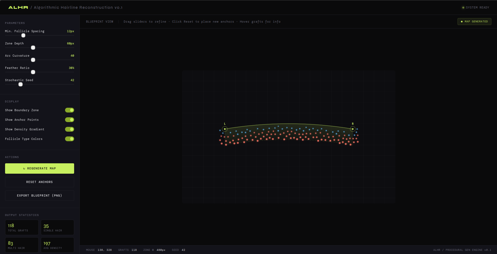

## **Algorithmic-Hairline-Reconstruction**

A procedural generation tool for hair transplant planning and hairline design. This project leverages algorithms like **Poisson Disk Sampling** and **Bezier curves** to simulate natural hair follicle distributions and create aesthetically pleasing hairlines.

### **Project Screenshots**




*Example of procedural hairline generation with density variation.*


*Interactive Bezier curve controls for shaping the hairline.*

---

### **Core Algorithms**
* **Poisson Disk Sampling:** Ensures organic, evenly distributed graft placement without clumping, mimicking natural follicle patterns.
* **Bezier Curves:** Allows for smooth, dynamic definition of hairline arcs using interactive anchor points.
* **Stochastic Feathering:** Simulates natural density transitions at the leading edge for a realistic appearance.

### **Features**
* **Procedural Distribution:** Organic, non-overlapping graft placement.
* **Dynamic Arc Modeling:** Interactive anchor points and Bezier curvature.
* **Natural Transitioning:** Stochastic feathering logic for low-density edges.
* **Interactive Controls:** Real-time adjustment of spacing, depth, and density.

### **Technical Stack**
* **Language:** JavaScript
* **Rendering:** HTML5 Canvas API
* **Logic:** Custom implementation of Poisson Disk and Bezier algorithms.

### **Getting Started**
This is a client-side web application.
1. Clone the repository:
   ```bash
   git clone [https://github.com/arkalibaig/Algorithmic-Hairline-Reconstruction.git](https://github.com/arkalibaig/Algorithmic-Hairline-Reconstruction.git)
   cd Algorithmic-Hairline-Reconstruction
   ```
2. Open `alhr.html` in your web browser.

### **License**
This project is licensed under the MIT License.

---
